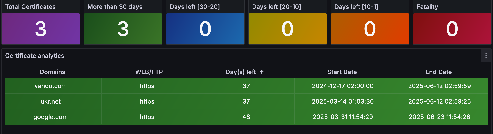

# Grafana Dashboard
```
https://github.com/kiimiki/ssl-exporter.git
dashboard.json
```

# 🛡️ SSL Exporter

Prometheus-compatible exporter that scans domains for SSL certificate expiration.  
Built for lightweight use in containerized environments.

---

## 📦 Docker Image

**Image:** `imitatop/ssl-exporter:latest`  
**Size:** ~15MB  
**Exposes:** `:9219` (Prometheus metrics)

---

## 🚀 Usage

### 🔹 Docker Run (standalone)

```bash
docker run -d \
  --name ssl-exporter \
  -p 9219:9219 \
  -v $(pwd)/domains.json:/app/domains.json \
  imitatop/ssl-exporter:latest
```

---

### 🔹 Docker Service (Docker Swarm)

```bash
docker service create \
  --name ssl-exporter \
  --network proxy-net \
  --mount type=bind,source=/path/to/domains.json,target=/app/domains.json,readonly \
  -p 9219:9219 \
  imitatop/ssl-exporter:latest
```

---

### 🔹 Docker Compose (Swarm-compatible)

```yaml
version: '3.8'

services:
  ssl-exporter:
    image: imitatop/ssl-exporter:latest
    networks:
      - proxy-net
    deploy:
      replicas: 1
      restart_policy:
        condition: on-failure
    ports:
      - 9219:9219
    volumes:
      - /path/to/domains.json:/app/domains.json:ro

networks:
  proxy-net:
    external: true
```

---

## 📈 Prometheus Configuration

```yaml
scrape_configs:
  - job_name: 'ssl-exporter'
    static_configs:
      - targets: ['ssl-exporter:9219']
```
